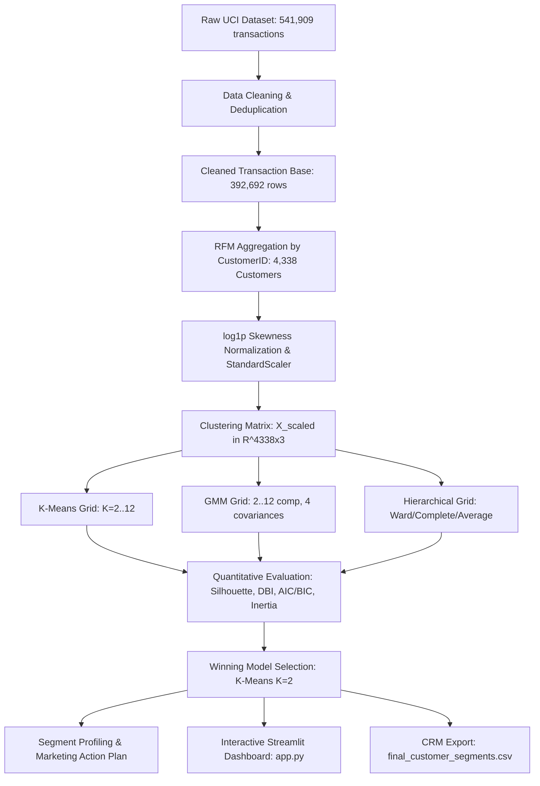

# 🛍️ Customer Segmentation Using Unsupervised Machine Learning

[](https://www.python.org/downloads/)
[](https://streamlit.io/)
[](https://opensource.org/licenses/MIT)
[]()

A comprehensive, mathematically rigorous, and submission-ready Artificial Intelligence university project for **Customer Segmentation & Behavioral Intelligence** on the canonical **UCI Online Retail Dataset** using unsupervised machine learning algorithms.

---

## 📌 Executive Summary & Key Results

This project designs, evaluates, and operationalizes an end-to-end unsupervised machine learning pipeline to discover latent customer segments from transactional log data (541,909 raw transactions -> 392,692 cleaned transactions -> 4,338 unique customer profiles).

### 🏆 Empirical Benchmark & Model Selection

Under identical normalized Log-RFM feature spaces (`LogRecency`, `LogFrequency`, `LogMonetary` with `StandardScaler`):

| Rank | Algorithm | Optimal Hyperparameters | Silhouette Score ($\uparrow$) | Davies-Bouldin Index ($\downarrow$) | Algorithm-Specific Metric | Complexity |
| :---: | :--- | :--- | :---: | :---: | :--- | :--- |
| **🥇 1** | **K-Means** | **$K = 2$ Clusters** | **0.4328** | **0.8925** | **Inertia = 6,483.59** | **$O(n \cdot k \cdot d \cdot i)$ [Fast]** |
| 🥈 2 | **Gaussian Mixture Model (GMM)** | 2 components, `spherical` cov | **0.4307** | **0.9023** | AIC = 32,563.45, BIC = 32,620.83 | $O(n \cdot k \cdot d^3 \cdot i)$ [Probabilistic] |
| 🥉 3 | **Hierarchical Agglomerative** | 2 clusters, `ward` linkage | **0.4040** | **0.9405** | Cophenetic Corr = 0.6096 | $O(n^2 \log n)$ to $O(n^3)$ [Tree] |

**Winner Announcement:** **K-Means ($K=2$)** is selected as the overall optimal model, achieving the highest Silhouette Score and lowest Davies-Bouldin Index, with linear computational scalability and instant inference latency for real-time CRM integration.

---

## 👥 Final Discovered Customer Segments

```
Total Customer Cohort: 4,338 Unique Customers
├── 🌟 High-Value Active Customers (38.4% | n=1,666)
│   ├── Median Recency: 16.0 days (Recent orders)
│   ├── Median Frequency: 6.0 orders (Mean: 8.44 orders)
│   ├── Median Spend: £2,061.08 (Mean: £4,539.60)
│   └── Strategy: VIP loyalty tiers, early collection previews, dedicated account support.
│
└── 💤 Low-Engagement / Lapsed Spenders (61.6% | n=2,672)
    ├── Median Recency: 96.0 days (Dormant / Inactive)
    ├── Median Frequency: 1.0 order (Mean: 1.67 orders)
    ├── Median Spend: £363.08 (Mean: £495.59)
    └── Strategy: Automated win-back drip emails, time-limited discounts, churn surveys.
```

---

## 🏗️ Architecture & Pipeline Overview



---

## 📁 Repository Structure

```
customer-segmentation/
├── app.py                         # Complete 6-page interactive Streamlit dashboard
├── prep.py                        # Canonical data loading, cleaning, RFM & scaling pipeline
├── customer_segmentation.py       # K-Means evaluation (K=2..12), selection, and plots
├── GMM.py                         # Gaussian Mixture Model evaluation, diagnostics & plots
├── hierarchical.py                # Hierarchical clustering, dendrograms & cophenetic analysis
├── segmentation_profiles.py       # Data-driven segment naming & business recommendations
├── generate_final_results.py      # Master headless script to generate all final artifacts
├── requirements.txt               # Python package dependencies
├── Online Retail.xlsx             # Canonical UCI Online Retail dataset file
│
├── final_artifacts/               # Generated empirical artifacts (CSVs, JSON, PNGs)
│   ├── final_model_comparison.csv # Comprehensive cross-model benchmark table
│   ├── final_segment_profiles.csv # Detailed customer segment summary table
│   ├── final_customer_segments.csv# Full 4,338 customer assignments with PC1/PC2
│   ├── final_metrics.json         # Complete machine-readable JSON evaluation log
│   ├── kmeans_selection.png       # K-Means Elbow & Silhouette curves
│   ├── gmm_selection.png          # GMM Silhouette, DBI, AIC, BIC curves
│   ├── hierarchical_selection.png # Hierarchical Ward selection curves
│   ├── dendrogram.png             # Presentation-grade Hierarchical dendrogram tree
│   ├── gmm_probability_histogram.png # Max posterior assignment probability histogram
│   ├── model_comparison_silhouette.png # Cross-model Silhouette Score bar chart
│   ├── model_comparison_dbi.png   # Cross-model Davies-Bouldin Index bar chart
│   ├── final_pca_segments.png     # 2D PCA customer segment scatter plot
│   ├── final_segment_sizes.png    # Customer segment distribution bar chart
│   ├── rfm_distributions.png      # Raw vs Log-transformed RFM feature histograms
│   └── correlation_heatmap.png    # Feature correlation matrix heatmap
│
└── submission/                    # University submission documentation
    ├── FINAL_REPORT.md            # Complete 6-section academic report in APA 7th style
    ├── REPORT_DATA.md             # Copy-paste ready reference tables of all exact numbers
    ├── FIGURES_TO_USE.md          # Visual placement guide for figures and report sections
    ├── DEMO_GUIDE.md              # 5-7 minute live presentation and viva voce script
    ├── QA_PREPARATION.md          # 30+ lecturer questions and rigorous technical answers
    └── AI_DISCLOSURE_DRAFT.md     # Formal academic AI tool disclosure statement
```

---

## 🚀 Quickstart & Reproduction Guide

### 1. Environment Setup
```bash
# Clone repository
git clone https://github.com/thienhn05/customer-segmentation.git
cd customer-segmentation

# Create Python virtual environment
python3 -m venv .venv
source .venv/bin/activate

# Install required dependencies
pip install -r requirements.txt
```

### 2. Run Headless Artifact Generation
To reproduce all empirical metrics, benchmark tables, and high-resolution figures:
```bash
python generate_final_results.py
```
*Output: Generates and populates all 15 files in `final_artifacts/` within ~2 minutes.*

### 3. Launch Interactive Streamlit Dashboard
```bash
streamlit run app.py
```
Open your browser at `http://localhost:8501` to access the 6-page interactive dashboard:
- **Page 1: Home** — Executive overview, metrics cards, and pipeline flowchart.
- **Page 2: Data Overview** — Cleaning funnel, skewness histograms, and 2D PCA view.
- **Page 3: Clustering Analysis** — Interactive K-Means, GMM uncertainty, and Hierarchical Dendrogram tabs.
- **Page 4: Model Comparison** — Side-by-side benchmark tables and trade-off matrix.
- **Page 5: Final Customer Segmentation** — Segment profile cards, interactive PCA scatter plot, and CSV data export.
- **Page 6: About & Methodology** — Mathematical formulas, evaluation indices, and course references.

---

## 🔬 Mathematical Formulations of Validation Metrics

### 1. Silhouette Score ($s$)
For each sample $i$, let $a(i)$ be the mean intra-cluster distance to all other points in the same cluster, and $b(i)$ be the mean nearest-cluster distance:
$$s(i) = \frac{b(i) - a(i)}{\max(a(i), b(i))}, \quad s(i) \in [-1, +1]$$

### 2. Davies-Bouldin Index ($DB$)
Let $R_{ij} = \frac{s_i + s_j}{d(c_i, c_j)}$ denote the similarity measure between clusters $i$ and $j$:
$$DB = \frac{1}{k} \sum_{i=1}^{k} \max_{j \neq i} R_{ij}$$

### 3. Cophenetic Correlation Coefficient ($c$)
Measures how faithfully the hierarchical dendrogram preserves original pairwise Euclidean distances:
$$c = \frac{\sum_{i < j} (d_{ij} - \bar{d})(t_{ij} - \bar{t})}{\sqrt{\sum_{i < j} (d_{ij} - \bar{d})^2 \sum_{i < j} (t_{ij} - \bar{t})^2}}$$

---

## 🎓 Academic Submission Information

- **Module / Course:** Artificial Intelligence / Machine Learning
- **Student Name:** [STUDENT NAME]
- **Student ID:** [STUDENT ID]
- **Tutorial Group:** [TUTORIAL GROUP]
- **Dataset Reference:** Daqing Chen (2015), *Online Retail Dataset*, UCI Machine Learning Repository, DOI: `10.24432/C5BW33`.
- **License:** MIT Open Source License
