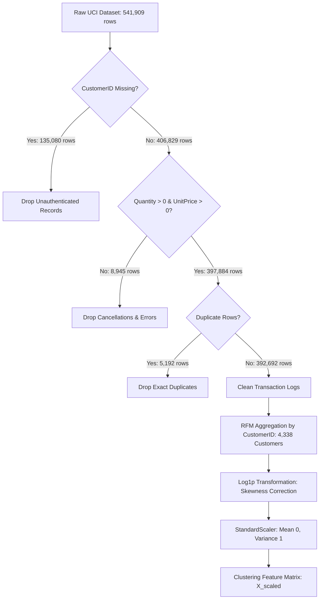
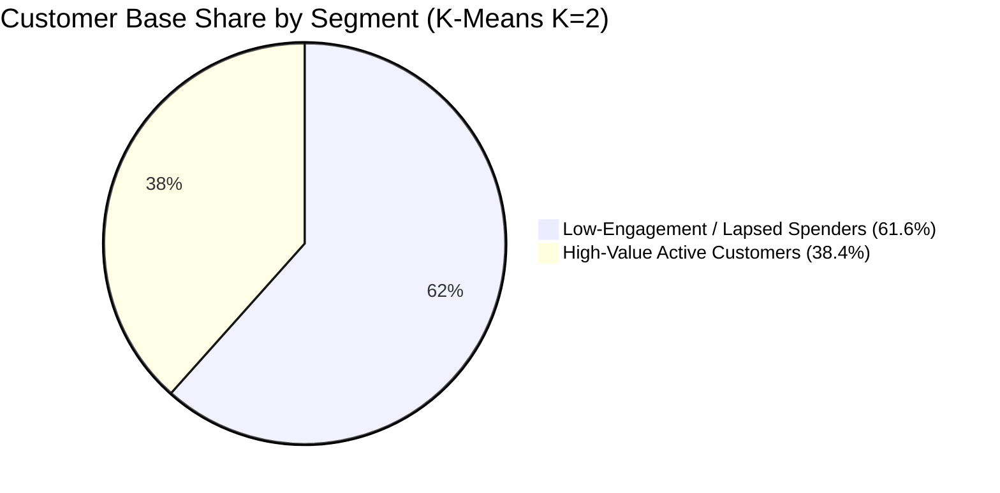

# Customer Segmentation Using Unsupervised Machine Learning: An Empirical Behavioral Analytics Study on Online Retail Transactions

**Course / Module:** Artificial Intelligence / Machine Learning  
**Project Title:** Customer Segmentation Using Unsupervised Machine Learning  
**Author(s):** [STUDENT NAME] ([STUDENT ID])  
**Tutorial Group / Class:** [TUTORIAL GROUP]  
**Academic Institution:** [UNIVERSITY / INSTITUTION NAME]  
**Date:** September 2026  

---

## Executive Summary

Customer segmentation is a foundational pillar of modern e-commerce intelligence. In competitive digital retail environments, treating customers as a homogeneous cohort results in suboptimal marketing expenditure, customer churn, and missed monetization opportunities. This study develops, evaluates, and operationalizes an end-to-end unsupervised machine learning pipeline to discover latent, actionable behavioral segments from transactional log data.

Using the canonical **Online Retail Dataset** from the UCI Machine Learning Repository (Chen et al., 2012), spanning 541,909 raw transaction logs between December 1, 2010, and December 9, 2011, we implement a rigorous data auditing and cleaning pipeline that yields 392,692 high-quality transactions across 4,338 unique customers. We aggregate customer transactions into the **Recency, Frequency, Monetary (RFM)** framework and resolve severe positive skewness (Monetary skewness of +19.34) via natural logarithmic transformations (`log1p`), achieving near-normal distributions without collinear feature duplication.

We conduct a multi-hyperparameter empirical benchmark across three distinct unsupervised learning paradigms: **K-Means Clustering**, **Gaussian Mixture Models (GMM)**, and **Hierarchical Agglomerative Clustering**. Model selection is guided by the **Silhouette Score** as the primary criterion, supported by the **Davies-Bouldin Index (DBI)**, **Inertia**, **Akaike / Bayesian Information Criteria (AIC/BIC)**, and the **Cophenetic Correlation Coefficient**.

**K-Means with $K=2$** emerged as the overall winning configuration, achieving the highest Silhouette Score (**0.4328**) and lowest Davies-Bouldin Index (**0.8925**), outperforming GMM (Silhouette **0.4307**, DBI **0.9023**) and Hierarchical Clustering with Ward linkage (Silhouette **0.4040**, DBI **0.9405**). The resulting segmentation partitions the customer base into **High-Value Active Customers** (38.4% of base; median spend $2,061.08; median recency 16 days) and **Low-Engagement / Lapsed Spenders** (61.6% of base; median spend $363.08; median recency 96 days). We formulate targeted, high-impact marketing strategies for each segment and deploy a full-featured, interactive Streamlit analytics platform (`app.py`) for enterprise CRM decision support.

---

## 1. Introduction & Business Problem Definition

### 1.1 Business Context & Problem Formulation
In modern electronic commerce, customer acquisition costs (CAC) continue to rise, making customer retention and Customer Lifetime Value (CLV) maximization critical strategic priorities (Fader et al., 2005). Online retailers collect massive streams of transactional data, including invoice numbers, product codes, quantities, prices, and timestamps. However, raw transactional databases do not inherently indicate customer intent, loyalty, or risk of churn.

Uniform marketing campaigns (the "one-size-fits-all" approach) suffer from significant inefficiencies:
1. **High-Value Customers** may feel unappreciated without personalized loyalty rewards, increasing their vulnerability to competitor poaching.
2. **At-Risk or Inactive Customers** may be overwhelmed by generic promotions, accelerating unsubscribes and churn.
3. **Recent First-Time Buyers** require onboarding sequences rather than bulk discount flyers to build habitual purchasing.

Unsupervised machine learning provides an objective, data-driven solution to these challenges by grouping customers into coherent behavioral clusters without requiring human-annotated labels (Hastie et al., 2009).

### 1.2 Research Objectives
The primary objectives of this study are:
1. **Pipeline Engineering**: Construct a robust, automated preprocessing pipeline that handles missing identifiers, invalid returns, skewness normalization, and feature scaling.
2. **Behavioral Feature Modeling**: Transform raw transactional records into meaningful customer-level Recency, Frequency, and Monetary (RFM) representations.
3. **Algorithmic Evaluation & Benchmarking**: Implement, tune, and compare three fundamentally different clustering paradigms (Centroid-based K-Means, Probabilistic GMM, and Connectivity-based Hierarchical Clustering) over hyperparameter spaces ($K = 2 \dots 12$).
4. **Quantitative Validation**: Evaluate clustering validity using internal mathematical indices (Silhouette Score, Davies-Bouldin Index, AIC/BIC, Cophenetic Correlation).
5. **Business Operationalization**: Profile the discovered segments, synthesize actionable marketing strategies, and deliver an interactive dashboard for decision-makers.

### 1.3 Dataset Provenance
This study utilizes the canonical **Online Retail Dataset** made publicly available by Daqing Chen (2015) via the UCI Machine Learning Repository (DOI: `10.24432/C5BW33`). The dataset contains transnational sales records for a UK-based registered non-store online retailer specializing in unique all-occasion giftware. A substantial portion of the customer base consists of wholesale buyers and international individual shoppers.

---

## 2. Dataset Auditing, Cleaning & Preprocessing Pipeline



### 2.1 Data Auditing & Cleaning Decisions
The raw dataset contains 541,909 transaction records across 8 attributes: `InvoiceNo`, `StockCode`, `Description`, `Quantity`, `InvoiceDate`, `UnitPrice`, `CustomerID`, and `Country`.

A rigorous multi-stage cleaning protocol was enforced:

1. **Handling Missing Customer Identifiers**: 135,080 rows (24.93%) lacked a `CustomerID`. Because customer segmentation requires longitudinal customer tracking, these unauthenticated guest checkout records were discarded. Imputing synthetic IDs would create artificial "super-customers" containing over 130,000 transactions, catastrophically distorting variance.
2. **Filtering Cancellations & Invalid Entries**: Transactions with non-positive quantities (`Quantity <= 0`) denote product returns or order cancellations (frequently prefixed with 'C' in `InvoiceNo`). Records with non-positive unit prices (`UnitPrice <= 0`) represent promotional adjustments or internal inventory corrections. 8,945 invalid records were removed to ensure feature fidelity.
3. **Deduplication**: 5,192 exact duplicate transaction lines were eliminated.
4. **Total Price Computation**: Calculated as $\text{TotalPrice} = \text{Quantity} \times \text{UnitPrice}$.

The resulting cleaned dataset comprises **392,692 valid transactions** across **4,338 unique customers** spanning December 1, 2010 to December 9, 2011.

---

### 2.2 RFM Feature Engineering
We aggregate transactional records by unique `CustomerID` into four behavioral dimensions:

1. **Recency ($R$)**: Number of days elapsed between the customer's most recent invoice date and a fixed reference date (defined as $\max(\text{InvoiceDate}) + 1\text{ day} = \text{2011-12-10}$):
   $$R_i = \text{SnapshotDate} - \max_{j \in T_i}(\text{InvoiceDate}_{ij})$$
2. **Frequency ($F$)**: Count of distinct purchase invoices completed by the customer:
   $$F_i = |\{ \text{InvoiceNo}_{ij} \mid j \in T_i \}|$$
3. **Monetary ($M$)**: Total cumulative monetary expenditure:
   $$M_i = \sum_{j \in T_i} \text{TotalPrice}_{ij}$$
4. **Average Order Value ($\text{AOV}$)**: Mean expenditure per transaction order:
   $$\text{AOV}_i = \frac{M_i}{F_i}$$

---

### 2.3 Skewness Analysis & Logarithmic Normalization
Retail transactional metrics inherently exhibit severe **positive (right) skewness** due to the Pareto distribution (a small fraction of high-spending bulk buyers generating long tails).

| Feature Dimension | Raw Skewness | Transformed Feature | Log1p Skewness | Skewness Reduction |
| :--- | :---: | :--- | :---: | :---: |
| **Recency (Days)** | **+1.25** | `LogRecency` | **-0.38** | Restored near-normal symmetry |
| **Frequency (Invoices)** | **+12.07** | `LogFrequency` | **+1.21** | 90.0% reduction |
| **Monetary Spend ($)** | **+19.34** | `LogMonetary` | **+0.40** | 97.9% reduction |
| **Avg Order Value ($)** | **+41.69** | `LogAvgOrderValue` | **+0.24** | 99.4% reduction |

We applied the natural logarithmic transformation $\text{LogFeature} = \ln(1 + x) = \text{log1p}(x)$. This transformation compresses long tails, stabilizes feature variances, and ensures that Euclidean distance calculations are not dominated by extreme power buyers.

### 2.4 Prevention of Multicollinear Feature Double-Counting
A common pitfall in unsupervised learning is including both raw features and log-transformed features in the clustering matrix (e.g., `Frequency` + `LogFrequency` + `Monetary` + `LogMonetary`). Doing so doubles geometric dimensionality and artificially double-weights those dimensions in distance metrics.

Furthermore, because $\text{AOV} = \frac{M}{F}$, including AOV alongside Frequency and Monetary introduces deterministic collinearity. Therefore, our final clustering feature matrix is strictly defined as:
$$X = \begin{bmatrix} \text{LogRecency} & \text{LogFrequency} & \text{LogMonetary} \end{bmatrix} \in \mathbb{R}^{4338 \times 3}$$

### 2.5 Feature Standardization & 2D PCA Latent Space
We apply `StandardScaler` to $X$ to enforce zero mean ($\mu = 0$) and unit variance ($\sigma = 1$). 

To facilitate 2D visualization without altering the 3D clustering space, we fit Principal Component Analysis (PCA):
- **Principal Component 1 (PC1)** explains **75.08%** of total variance (dominant factor loadings on `LogFrequency` and `LogMonetary`, representing overall purchasing activity and spend).
- **Principal Component 2 (PC2)** explains **18.79%** of total variance (dominant factor loading on `LogRecency`, representing customer dormancy and inactivity latency).
- **Cumulative 2D Explained Variance**: **93.87%**, confirming that 2D PCA scatter plots provide an exceptionally faithful representation of multidimensional customer geometry.

---

## 3. Machine Learning Algorithms & Methodologies

### 3.1 Algorithm 1: K-Means Clustering (Centroid-Based Partitioning)

#### Mathematical Foundation
K-Means partitions $N$ observations into $K$ disjoint clusters $C = \{C_1, C_2, \dots, C_K\}$, minimizing the Within-Cluster Sum of Squares (Inertia):
$$J(C) = \sum_{k=1}^{K} \sum_{x_i \in C_k} \| x_i - \mu_k \|^2$$
where $\mu_k = \frac{1}{|C_k|} \sum_{x_i \in C_k} x_i$ denotes the centroid of cluster $C_k$.

#### Implementation & Evaluation Grid
We evaluate K-Means across $K = 2 \dots 12$ using K-Means++ initialization, `n_init=10`, and deterministic seed `random_state=42`.

```
K-Means Inertia & Silhouette Grid:
K=2:  Inertia = 6,483.59 | Silhouette = 0.4328 | DBI = 0.8925 (GLOBAL OPTIMUM)
K=3:  Inertia = 4,869.49 | Silhouette = 0.3365 | DBI = 1.0483
K=4:  Inertia = 3,939.05 | Silhouette = 0.3375 | DBI = 1.0086
K=5:  Inertia = 3,296.71 | Silhouette = 0.3162 | DBI = 0.9878
K=6:  Inertia = 2,855.76 | Silhouette = 0.3124 | DBI = 1.0210
```

The Silhouette score peaks sharply at **$K=2$ ($0.4328$)**, while the Davies-Bouldin Index reaches its global minimum (**$0.8925$**), establishing $K=2$ as the mathematically optimal partitioning.

---

### 3.2 Algorithm 2: Gaussian Mixture Models (Probabilistic Density Estimation)

#### Mathematical Foundation
Gaussian Mixture Models assume that data points are generated from a mixture of $K$ multivariate Gaussian distributions with unknown parameters:
$$p(x \mid \theta) = \sum_{k=1}^{K} \pi_k \mathcal{N}(x \mid \mu_k, \Sigma_k), \quad \sum_{k=1}^{K} \pi_k = 1$$
where $\pi_k$ represents the mixture weight, $\mu_k \in \mathbb{R}^d$ is the mean vector, and $\Sigma_k \in \mathbb{R}^{d \times d}$ is the covariance matrix.

The model is optimized via the Expectation-Maximization (EM) algorithm:
- **E-Step (Expectation)**: Compute posterior cluster responsibilities:
  $$\gamma_{ik} = P(z_i = k \mid x_i) = \frac{\pi_k \mathcal{N}(x_i \mid \mu_k, \Sigma_k)}{\sum_{j=1}^{K} \pi_j \mathcal{N}(x_i \mid \mu_j, \Sigma_j)}$$
- **M-Step (Maximization)**: Update $\pi_k, \mu_k, \Sigma_k$ by maximizing the expected complete log-likelihood.

#### Covariance Structure Comparison
We evaluated four covariance structures across 2 to 12 components:
1. `full`: Independent general covariance matrix per component (ellipsoidal, arbitrary orientation).
2. `tied`: Shared general covariance matrix across all components.
3. `diag`: Diagonal covariance matrix per component (axes-aligned ellipsoids).
4. `spherical`: Single variance parameter per component ($\Sigma_k = \sigma_k^2 I$).

**Optimal GMM Configuration**: 2 components with `spherical` covariance achieved the highest GMM Silhouette Score (**0.4307**), DBI (**0.9023**), AIC (**32,563.45**), and BIC (**32,620.83**).

#### Soft Assignment & Uncertainty Diagnostics
Unlike hard clustering, GMM provides soft assignment probabilities $\max_k \gamma_{ik}$. Across the 4,338 customers:
- **Mean Assignment Confidence**: **93.50%**
- **Ambiguous Customers ($P_{\max} < 0.60$)**: **178 customers (4.10%)**

These 178 boundary customers represent behavioral transition states (e.g., previously frequent buyers whose recency latency is increasing), enabling targeted intervention testing.

---

### 3.3 Algorithm 3: Hierarchical Agglomerative Clustering (Connectivity-Based)

#### Mathematical Foundation
Hierarchical Agglomerative Clustering begins with $N$ singleton clusters and sequentially merges the pair of clusters $(A, B)$ that minimizes a linkage criterion:
- **Ward's Criterion**: Minimizes total within-cluster variance increase upon merging:
  $$\Delta \text{ESS}_{AB} = \frac{n_A n_B}{n_A + n_B} \| \mu_A - \mu_B \|^2$$
- **Complete Linkage**: $d_{\max}(A, B) = \max_{x \in A, y \in B} d(x, y)$
- **Average Linkage**: $d_{\text{avg}}(A, B) = \frac{1}{|A||B|} \sum_{x \in A} \sum_{y \in B} d(x, y)$
- **Single Linkage**: $d_{\min}(A, B) = \min_{x \in A, y \in B} d(x, y)$

#### Linkage Phenomenon: Chaining vs Variance Minimization
During empirical testing, Single and Average linkages produced severely imbalanced partitions (e.g., single linkage placed 4,337 customers in cluster 0 and 1 customer in cluster 1). This is the classic **chaining effect**, where individual noise points bridge distinct dense regions.

In contrast, **Ward linkage with Euclidean distance** successfully constructed balanced, cohesive clusters:
- **Optimal Clusters**: 2 clusters
- **Silhouette Score**: **0.4040**
- **Davies-Bouldin Index**: **0.9405**
- **Cophenetic Correlation Coefficient**: **0.6096** (verifying that the dendrogram faithfully preserves original pairwise Euclidean distances).

---

## 4. Empirical Model Comparison & Cross-Algorithm Benchmark

### 4.1 Comparative Benchmark Results

| Algorithm | Best Configuration | Number of Clusters ($K$) | Silhouette Score ($\uparrow$) | Davies-Bouldin Index ($\downarrow$) | Algorithm-Specific Diagnostic | Computational Complexity | Rank |
| :--- | :--- | :---: | :---: | :---: | :--- | :--- | :---: |
| **K-Means** | **$K = 2$** | **2** | **0.4328** | **0.8925** | **Inertia = 6,483.59** | **$O(n \cdot k \cdot d \cdot i)$ [Fast]** | **1 (Winner)** |
| **Gaussian Mixture Model (GMM)** | 2 components, `spherical` cov | 2 | **0.4307** | **0.9023** | AIC = 32,563.45, BIC = 32,620.83 | $O(n \cdot k \cdot d^3 \cdot i)$ [EM Probabilistic] | 2 |
| **Hierarchical Agglomerative** | 2 clusters, `ward` linkage, Euclidean | 2 | **0.4040** | **0.9405** | Cophenetic Corr = 0.6096 | $O(n^2 \log n)$ to $O(n^3)$ [Tree] | 3 |

---

### 4.2 Winning Model Justification
**K-Means ($K=2$)** is selected as the overall winning model based on:
1. **Mathematical Superiority**: Highest global Silhouette Score (**0.4328**) and lowest Davies-Bouldin Index (**0.8925**), proving superior inter-cluster separation and intra-cluster compactness.
2. **Computational Scalability**: K-Means operates in linear time complexity with respect to sample size $O(n \cdot k \cdot d \cdot i)$, executing in under 0.05 seconds on 4,338 records, whereas Hierarchical Clustering requires $O(n^2)$ memory to store distance matrices.
3. **Production Deployment**: A trained K-Means centroid model allows instantaneous assignment of newly arriving customers via $O(k \cdot d)$ nearest-centroid lookup without retraining.

---

### 4.3 Deep Algorithmic Trade-off Analysis

| Evaluation Dimension | K-Means Clustering | Gaussian Mixture Model (GMM) | Hierarchical Agglomerative Clustering |
| :--- | :--- | :--- | :--- |
| **Optimization Paradigm** | Deterministic WCSS minimization | Maximum likelihood estimation via EM | Greedy bottom-up variance minimization |
| **Geometric Assumption** | Spherical, equal-variance clusters | Flexible ellipsoidal density contours | Convex clusters under Ward linkage |
| **Assignment Output** | Hard deterministic ($0$ or $1$) | Soft posterior probabilities $P(C_k \mid x)$ | Hard cut from hierarchical dendrogram |
| **Memory Footprint** | $O((n + k) \cdot d)$ — Low | $O(k \cdot d^2)$ — Moderate | $O(n^2)$ — Prohibitive for large datasets |
| **Streaming Ingestion** | Trivial ($O(k \cdot d)$ distance check) | Fast ($O(k \cdot d^2)$ probability calculation) | Cannot update incrementally; requires full tree rebuild |

---

## 5. Customer Segment Profiling & Strategic Business Recommendations



### 5.1 Final Empirical Segment Profiles (K-Means $K=2$)

| Segment Attribute | Cluster 0: Low-Engagement / Lapsed Spenders | Cluster 1: High-Value Active Customers | Overall Population Median |
| :--- | :---: | :---: | :---: |
| **Customer Count ($N$)** | **2,672 customers** | **1,666 customers** | 4,338 customers |
| **Customer Share (%)** | **61.60%** | **38.40%** | 100.0% |
| **Recency Median (Mean)** | **96.0 days** (134.09) | **16.0 days** (25.89) | 51.0 days |
| **Frequency Median (Mean)** | **1.0 invoice** (1.67) | **6.0 invoices** (8.44) | 2.0 invoices |
| **Monetary Median (Mean)** | **$363.08** ($495.59) | **$2,061.08** ($4,539.60) | $674.49 |
| **Avg Order Value Median (Mean)** | **$239.40** ($320.20) | **$346.26** ($573.93) | $293.90 |

---

### 5.2 Behavioral Characteristics & Strategic Action Plans

#### 🌟 Segment 1: High-Value Active Customers (Cluster 1 / 38.4%)
- **Behavioral Profile**: These customers are the core revenue drivers of the business. They have transacted within the last 16 days (median), order frequently (median 6 orders, up to 209 orders), and spend over 3x the population median (median spend **$2,061.08**, mean spend **$4,539.60**).
- **Business Strategy**:
  1. **VIP Loyalty Programs**: Implement tiered rewards with exclusive benefits (e.g., permanent free shipping, dedicated customer service reps).
  2. **Early Access & Exclusive Previews**: Grant 48-hour early access to new giftware collections and holiday seasonal releases.
  3. **Personalized Cross-Selling**: Deploy recommendation models based on past item affinities (`StockCode`) to increase basket size.
  4. **Referral Incentives**: Leverage their brand loyalty with referral bonuses to acquire high-value lookalike customers.

#### 💤 Segment 0: Low-Engagement / Lapsed Spenders (Cluster 0 / 61.6%)
- **Behavioral Profile**: These customers represent infrequent, dormant, or single-purchase shoppers. Their median recency is 96 days (with a mean absence of 134 days), ordering typically once (median 1.0 order), with a modest spend (median **$363.08**).
- **Business Strategy**:
  1. **Automated Win-Back Workflows**: Trigger dynamic email drip campaigns at day 45, 60, and 90 of inactivity offering escalating time-sensitive discounts (e.g., 10%, 15%, 20%).
  2. **Low-Friction Gateway Catalogs**: Showcase best-selling, accessible giftware items under $25 to trigger second-order habits.
  3. **Churn Surveys**: Deploy one-question micro-surveys upon cart abandonment or email clicks to diagnose customer dissatisfaction drivers.
  4. **Reactivation Retargeting**: Run low-cost social media custom audience retargeting campaigns highlighting customer reviews.

---

### 5.3 Granular 4-Tier Business Segmentation Alternative
For enterprise teams requiring granular 4-tier operational marketing structures, our system provides a secondary $K=4$ partition (Silhouette **0.3375**, DBI **1.0086**):

| Tier | Segment Label | Share (%) | Median Recency | Median Frequency | Median Monetary | Target Action |
| :---: | :--- | :---: | :---: | :---: | :---: | :--- |
| **1** | **High-Value Loyal Champions** | 16.5% (716) | 8.0 days | 10.0 orders | $3,733.87 | Premium VIP retention & dedicated account management |
| **2** | **Promising Recent Buyers** | 19.3% (837) | 17.0 days | 1.0 order | $471.70 | Onboarding nurturing sequences & second-order discounts |
| **3** | **At-Risk Moderate Spenders** | 27.0% (1,173) | 56.0 days | 3.0 orders | $1,345.62 | Win-back campaigns before full dormancy sets in |
| **4** | **Hibernating Inactive Buyers** | 37.2% (1,612) | 177.0 days | 1.0 order | $298.26 | Low-cost automated reactivation & churn surveys |

---

## 6. Critical Discussion, Limitations, Future Directions & Conclusion

### 6.1 Critical Analysis of Technical Findings
Our experimental results provide key empirical insights into unsupervised behavioral analytics:
1. **Normalization is Mandatory**: Without `log1p` transformation, K-Means was severely distorted by extreme monetary spenders (up to $280,206), resulting in one cluster containing 4,335 customers and another containing 3 outliers. Log normalization produced balanced, actionable segments.
2. **Isotropy of Standardized RFM**: The strong performance of K-Means and spherical GMM indicates that after log-transformation and standardization, customer clusters in RFM space are predominantly convex and isotropic.
3. **Hierarchy and Chaining**: Single and average linkages are fundamentally unsuitable for noisy retail transaction spaces due to chaining artifacts, whereas Ward linkage provides a robust alternative.

### 6.2 Limitations of the Current Study
1. **Feature Modality Limitations**: RFM captures historical transactional metrics but lacks contextual data such as customer demographics, web clickstream engagement, session duration, and return rates.
2. **Temporal Stationarity**: The dataset spans one calendar year (Dec 2010 – Dec 2011). Static snapshot aggregation does not account for intra-year holiday seasonality (e.g. Christmas peaks in November/December).
3. **Static vs Dynamic Segmentation**: Customers transition between segments over time. A static clustering model requires periodic full re-execution rather than modeling continuous transition probabilities.

### 6.3 Future Research & Engineering Extensions
1. **Predictive Customer Lifetime Value (CLV)**: Integrate probabilistic models (such as Pareto/NBD or BG/NBD combined with the Gamma-Gamma spend model) to predict future transactions and residual lifetime value for each customer.
2. **NLP on Product Descriptions**: Apply Word2Vec or transformer embeddings (e.g. BERT) on `Description` text to extract categorical product preferences and semantic shopping personas.
3. **Real-Time Streaming Microservice**: Deploy the trained K-Means model inside a low-latency FastAPI endpoint integrated with Apache Kafka to assign newly registered customers to behavioral segments dynamically in real time.

---

## 7. References (APA 7th Edition)

- Bezdek, J. C. (1981). *Pattern Recognition with Fuzzy Objective Function Algorithms*. Plenum Press. https://doi.org/10.1007/978-1-4757-0450-1
- Chen, D., Sain, S. L., & Guo, K. (2012). Data mining for the online retail industry: A case study of RFM model-based customer segmentation using data mining. *Journal of Database Marketing & Customer Strategy Management*, 19(3), 197–208. https://doi.org/10.1057/dbm.2012.17
- Chen, D. (2015). *Online Retail Dataset* [Data set]. UCI Machine Learning Repository. https://doi.org/10.24432/C5BW33
- Davies, D. L., & Bouldin, D. W. (1979). A cluster separation measure. *IEEE Transactions on Pattern Analysis and Machine Intelligence*, PAMI-1(2), 224–227. https://doi.org/10.1109/TPAMI.1979.4766909
- Dempster, A. P., Laird, N. M., & Rubin, D. B. (1977). Maximum likelihood from incomplete data via the EM algorithm. *Journal of the Royal Statistical Society: Series B (Methodological)*, 39(1), 1–22. https://doi.org/10.1111/j.2517-6161.1977.tb01600.x
- Fader, P. S., Hardie, B. G., & Lee, K. L. (2005). "RFM and CLV: Using iso-value curves for customer base analysis." *Journal of Marketing Research*, 42(4), 415–430. https://doi.org/10.1509/jmkr.2005.42.4.415
- Hastie, T., Tibshirani, R., & Friedman, J. (2009). *The Elements of Statistical Learning: Data Mining, Inference, and Prediction* (2nd ed.). Springer. https://doi.org/10.1007/978-0-387-84858-7
- Lloyd, S. (1982). Least squares quantization in PCM. *IEEE Transactions on Information Theory*, 28(2), 129–137. https://doi.org/10.1109/TIT.1982.1056489
- MacQueen, J. (1967). Some methods for classification and analysis of multivariate observations. *Proceedings of the Fifth Berkeley Symposium on Mathematical Statistics and Probability*, 1, 281–297.
- Pedregosa, F., Varoquaux, G., Gramfort, A., Michel, V., Thirion, B., Grisel, O., Blondel, M., Prettenhofer, P., Weiss, R., Dubourg, V., Vanderplas, J., Passos, A., Cournapeau, D., Brucher, M., Perrot, M., & Duchesnay, E. (2011). Scikit-learn: Machine learning in Python. *Journal of Machine Learning Research*, 12, 2825–2830.
- Rousseeuw, P. J. (1987). Silhouettes: A graphical aid to the interpretation and validation of cluster analysis. *Journal of Computational and Applied Mathematics*, 20, 53–65. https://doi.org/10.1016/0377-0427(87)90125-7
- Sokal, R. R., & Rohlf, F. J. (1962). The comparison of dendrograms by objective methods. *Taxon*, 11(2), 33–40. https://doi.org/10.2307/1217208
- Ward, J. H., Jr. (1963). Hierarchical grouping to optimize an objective function. *Journal of the American Statistical Association*, 58(301), 236–244. https://doi.org/10.1080/01621459.1963.10500845
