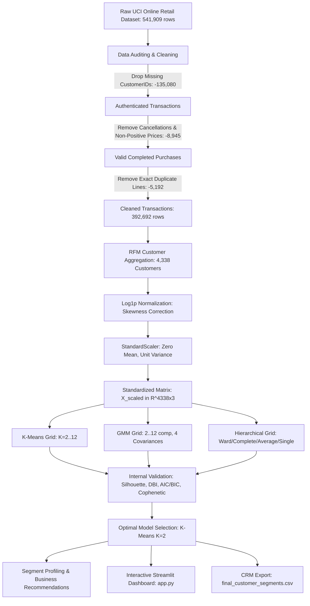
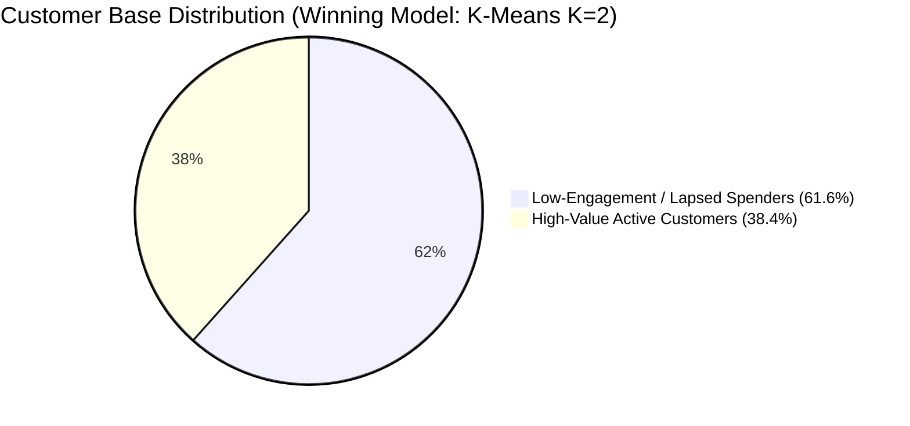

# Customer Segmentation Using Unsupervised Machine Learning: A Comparative Empirical Study on Online Retail Transactions

**Course / Module:** Artificial Intelligence / Machine Learning  
**Project Title:** Customer Segmentation Using Unsupervised Machine Learning  
**Academic Session:** 2025/2026  
**Institution:** [UNIVERSITY / INSTITUTION NAME]  

---

### Group Member Contribution & Algorithm Responsibilities

| Member Role | Student Full Name | Student ID | Algorithm Responsibility |
| :--- | :--- | :--- | :--- |
| **Member 1** | [STUDENT NAME 1] | [STUDENT ID 1] | **K-Means Clustering** |
| **Member 2** | [STUDENT NAME 2] | [STUDENT ID 2] | **Gaussian Mixture Models (GMM)** |
| **Member 3** | [STUDENT NAME 3] | [STUDENT ID 3] | **Hierarchical Agglomerative Clustering** |

**Tutorial Group / Class:** [TUTORIAL GROUP]  
**Tutor / Lecturer:** [TUTOR / LECTURER NAME]  
**Submission Date:** [SUBMISSION DATE]  

---

## 1. INTRODUCTION

### 1.1 Background
In digital commerce, customer segmentation is the analytical process of dividing a company's customer base into distinct, mutually exclusive sub-groups that share similar purchasing characteristics and behavioral patterns. With the rapid expansion of e-commerce platforms, enterprises continuously capture vast volumes of transactional log data, including order timestamps, item quantities, invoice values, and customer identifiers.

Unlike labeled supervised learning datasets where target outcomes (such as credit defaults or medical diagnoses) are known in advance, commercial retail logs do not contain predefined customer group labels. Unsupervised machine learning provides an objective, data-driven methodology to discover latent structures and natural groupings within such multidimensional datasets without human supervision (Hastie et al., 2009).

Within retail analytics, the **Recency, Frequency, and Monetary (RFM)** framework is a widely adopted behavioral paradigm. By measuring how recently a customer purchased (Recency), how often they purchase (Frequency), and how much they spend (Monetary), the RFM framework compresses granular transactional event logs into concise, customer-level behavioral representations suitable for cluster analysis (Fader et al., 2005).

---

### 1.2 Problem Statement
Despite the abundance of raw transactional data, online retailers face major operational challenges in understanding customer behavior:

1. **Absence of Predefined Labels**: Transactional logs record individual line-item purchases rather than customer categories, making supervised classification inapplicable.
2. **Subjectivity of Manual Grouping**: Heuristically setting arbitrary thresholds on spending or order counts is subjective, error-prone, and fails to capture multidimensional interactions across customer cohorts.
3. **Inefficiencies of Uniform Marketing**: Treating all customers with a single generic marketing strategy ignores behavioral heterogeneity, resulting in marketing budget waste and higher customer churn.
4. **Algorithmic Sensitivity & Assumption Differences**: Different clustering algorithms make fundamentally different geometric and probabilistic assumptions (e.g. spherical partitioning vs ellipsoidal density estimation vs hierarchical tree merging), which can yield substantially different segment boundaries.

Therefore, a controlled empirical study is necessary to evaluate multiple clustering paradigms under a standardized preprocessing pipeline and determine an optimal, defensible segmentation strategy.

---

### 1.3 Objectives / Aims
The primary objectives of this study are:

1. **Develop an Automated Preprocessing Pipeline**: Clean raw transaction logs, remove unauthenticated records and invalid cancellations, and normalize severe feature skewness via natural logarithmic (`log1p`) transformations.
2. **Formulate Behavioral RFM Customer Representations**: Construct normalized, standardized customer-level feature matrices without multicollinear feature duplication.
3. **Implement and Tune Three Distinct Clustering Algorithms**: Systematically train and optimize **K-Means**, **Gaussian Mixture Models (GMM)**, and **Hierarchical Agglomerative Clustering** across a candidate range of $K = 2 \dots 12$.
4. **Conduct a Rigorous Quantitative Benchmark**: Compare the competing algorithms using common internal clustering validation metrics (**Silhouette Score**, **Davies-Bouldin Index**) and algorithm-specific diagnostics (**Inertia**, **AIC/BIC**, **Cophenetic Correlation**).
5. **Translate Discovered Clusters into Actionable Business Strategy**: Profile the final segments with empirical descriptive statistics and deploy an interactive Streamlit application (`app.py`) for decision support.

---

### 1.4 Significance / Contribution of the Study
This study contributes to both applied data science and business practice:

- **Targeted Marketing & Resource Allocation**: Enables marketing teams to allocate promotional budgets efficiently by differentiating high-value loyal customers from lapsed or at-risk buyers.
- **Customer Retention & Churn Mitigation**: Identifies dormant customer cohorts early, enabling automated win-back workflows and re-engagement campaigns.
- **Data-Driven Decision Making**: Replaces subjective rule-based heuristics with an empirical, reproducible machine learning pipeline.
- **Controlled Academic Benchmark**: Demonstrates how data preprocessing (skewness normalization, multicollinearity prevention, standardization) directly impacts the comparative performance of centroid-based, probabilistic, and hierarchical clustering algorithms on identical data.

---

## 2. RELATED WORK

### 2.1 Review of Previous Studies
Customer segmentation using transactional data has been extensively investigated across data mining and marketing literature.

**Chen, Sain & Guo (2012)** conducted an empirical study on online retail customer segmentation using the RFM framework. They demonstrated that aggregating transaction logs into customer-level RFM features provides a concise and effective representation for unsupervised algorithms. Their work highlighted the challenge of extreme positive skewness in retail spend data and emphasized the necessity of data transformation prior to distance-based partitioning.

The foundational centroid-based clustering algorithm, **K-Means**, introduced by **MacQueen (1967)** and standardized by **Lloyd (1982)**, remains the most widely applied clustering technique in industry due to its computational efficiency $O(n \cdot k \cdot d \cdot i)$ and intuitive minimization of Within-Cluster Sum of Squares (WCSS). However, K-Means assumes isotropic (spherical) clusters with equal variance, which may struggle when clusters exhibit non-spherical or overlapping distributions.

To address the limitations of hard spherical partitioning, **Dempster, Laird & Rubin (1977)** introduced the **Expectation-Maximization (EM)** algorithm, which serves as the computational foundation for **Gaussian Mixture Models (GMM)**. GMM models the data as a mixture of multivariate Gaussian distributions, providing soft probabilistic cluster assignments and supporting flexible covariance structures (`full`, `tied`, `diag`, `spherical`). This allows GMM to capture ellipsoidal cluster geometries and quantify customer assignment uncertainty.

In connectivity-based clustering, **Ward (1963)** introduced a hierarchical agglomerative clustering method based on a minimum-variance criterion. Unlike single linkage (which is prone to chaining artifacts) or complete linkage (which is sensitive to outliers), Ward's method iteratively merges clusters to minimize the increase in total within-cluster variance. **Sokal & Rohlf (1962)** introduced the **Cophenetic Correlation Coefficient** to evaluate how faithfully a hierarchical dendrogram preserves original pairwise distances.

For internal cluster validation without ground-truth labels, **Rousseeuw (1987)** introduced the **Silhouette Score**, which measures the balance between intra-cluster cohesion and nearest-cluster separation. Concurrently, **Davies & Bouldin (1979)** developed the **Davies-Bouldin Index (DBI)**, evaluating the ratio of within-cluster scatter to inter-cluster centroid distance.

---

### 2.2 Research Gap and Justification for the Current Study

#### 2.2.1 Strengths of Previous Studies
Previous literature has established:
- The validity of the RFM behavioral framework for customer value modeling.
- The mathematical foundations of centroid-based, probabilistic, and hierarchical clustering algorithms.
- Standardized internal validation indices (Silhouette Score, Davies-Bouldin Index) for objective model evaluation.

#### 2.2.2 Limitations and Research Gaps
Despite these foundations, several practical and methodological gaps remain in existing literature:
1. **Isolated Evaluations**: Many studies evaluate only a single algorithm (e.g. K-Means alone) without a controlled, side-by-side comparison against probabilistic or hierarchical alternatives under identical data conditions.
2. **Preprocessing Inconsistencies**: When multiple algorithms are compared across different studies, variations in data cleaning, feature transformations, or scaling methods prevent fair cross-study conclusions.
3. **Feature Duplication Pitfalls**: Some implementations include both raw features and log-transformed duplicates (e.g. `Frequency` and `LogFrequency`), which artificially inflates the geometric weight of specific business dimensions in Euclidean space.
4. **Under-Exploration of Assignment Uncertainty**: Studies frequently overlook soft clustering probabilities in GMM and fail to analyze ambiguous boundary customers.

#### 2.2.3 Justification for the Current Study
Different clustering algorithms make fundamentally different geometric and probabilistic assumptions, and their relative effectiveness depends heavily on dataset characteristics and preprocessing.

Therefore, this project conducts a **controlled, fair comparison** of K-Means, Gaussian Mixture Models, and Hierarchical Agglomerative Clustering using the **SAME** canonical Online Retail dataset (Chen, 2015), the **SAME** standardized Log-RFM feature space, the **SAME** scaling pipeline, and **COMMON** clustering-quality metrics, followed by practical, data-driven customer segment profiling.

---

## 3. METHODOLOGY

### 3.1 Activity Diagram and System Flow Description



The system architecture follows a sequential pipeline:
1. **Data Ingestion & Cleaning**: Ingests the canonical Excel workbook, normalizes column names, filters invalid records, and computes total line prices.
2. **Feature Engineering**: Aggregates records by `CustomerID` into Recency, Frequency, and Monetary metrics.
3. **Transformation & Standardization**: Applies `log1p` to correct skewness, followed by `StandardScaler`.
4. **Model Training & Hyperparameter Search**: Trains candidate configurations across K-Means, GMM, and Hierarchical clustering over $K = 2 \dots 12$.
5. **Model Evaluation & Selection**: Computes validation metrics, identifies the optimal configuration based on Silhouette Score with DBI supporting evidence, profiles clusters, and renders the interactive dashboard.

---

### 3.2 Description and Analysis of Dataset

#### Canonical Dataset Provenance
This study uses the **Online Retail Dataset** (Chen, 2015) obtained from the UCI Machine Learning Repository (DOI: `10.24432/C5BW33`). The dataset covers transactions occurring between **01/12/2010 and 09/12/2011** for a UK-based non-store online retailer. All product prices and spending amounts are denominated in **Pound Sterling (£ / GBP)**.

#### Data Cleaning Funnel
The raw dataset contains 541,909 records across 8 attributes. The cleaning protocol produced the following funnel:

| Preprocessing Stage | Transaction Count | Rows Removed | Percentage of Initial | Rationale |
| :--- | :---: | :---: | :---: | :--- |
| **1. Raw Transaction Ingestion** | 541,909 | — | 100.0% | Initial dataset loaded from canonical source |
| **2. Remove Missing CustomerID** | 406,829 | 135,080 | 24.93% | Unregistered guest checkouts cannot be tracked longitudinally |
| **3. Filter Cancellations & Invalid Prices** | 397,884 | 8,945 | 1.65% | `Quantity <= 0` (cancellations/returns) or `UnitPrice <= 0` |
| **4. Deduplication** | **392,692** | 5,192 | 0.96% | Exact duplicate transaction rows removed |
| **Final Cleaned Transactions** | **392,692** | **149,217** | **72.46% retained** | High-quality valid transaction baseline |
| **Final Usable Unique Customers** | **4,338** | — | — | Distinct customer cohort for clustering |

#### RFM Behavioral Metrics
The cleaned transactions were aggregated per `CustomerID`:
- **Recency ($R$)**: Days since last purchase relative to snapshot date ($\text{2011-12-10}$):
  $$R_i = \text{SnapshotDate} - \max(\text{InvoiceDate}_i)$$
- **Frequency ($F$)**: Count of distinct purchase invoices:
  $$F_i = |\{ \text{InvoiceNo}_{ij} \}|$$
- **Monetary ($M$)**: Total spend in GBP (£):
  $$M_i = \sum (\text{Quantity}_{ij} \times \text{UnitPrice}_{ij})$$
- **Average Order Value ($\text{AOV}$)**: $M_i / F_i$ (retained for business interpretation).

#### Skewness Normalization & Multicollinearity Prevention
Retail transactional metrics naturally display severe positive skewness. To stabilize variance and satisfy the geometric assumptions of clustering algorithms, we applied natural logarithmic transformation $\text{LogFeature} = \ln(1 + x) = \text{log1p}(x)$:

| Feature | Raw Mean | Raw Median | Raw Skewness | Log1p Feature | Log1p Skewness | Skewness Reduction |
| :--- | :---: | :---: | :---: | :--- | :---: | :---: |
| **Recency (Days)** | 92.54 | 51.00 | **+1.25** | `LogRecency` | **-0.38** | Normalized |
| **Frequency (Invoices)** | 4.27 | 2.00 | **+12.07** | `LogFrequency` | **+1.21** | 90.0% reduction |
| **Monetary Spend (£)** | £2,054.27 | £674.49 | **+19.34** | `LogMonetary` | **+0.40** | 97.9% reduction |
| **Avg Order Value (£)** | £419.17 | £293.90 | **+41.69** | `LogAvgOrderValue` | **+0.24** | 99.4% reduction |

To avoid multicollinear double-counting, only the three transformed features `['LogRecency', 'LogFrequency', 'LogMonetary']` were standardized via `StandardScaler` to form the input matrix $X_{\text{scaled}} \in \mathbb{R}^{4338 \times 3}$.

Principal Component Analysis (PCA) was fitted on $X_{\text{scaled}}$ for 2D visualization:
- **PC1 explained variance:** **75.08%**
- **PC2 explained variance:** **18.79%**
- **Total 2D explained variance:** **93.87%**

PCA was used strictly for 2D visual representation; model training was executed on the full standardized 3D feature matrix.

---

### 3.3 Algorithm Selection & Description of Algorithms

#### 3.3.1 K-Means Clustering
K-Means partitions $N$ customer vectors into $K$ non-overlapping clusters $C = \{C_1, \dots, C_K\}$, minimizing Within-Cluster Sum of Squares (Inertia):
$$J(C) = \sum_{k=1}^{K} \sum_{x_i \in C_k} \| x_i - \mu_k \|^2$$
where $\mu_k$ is the mean centroid of cluster $C_k$. The algorithm alternates between assigning observations to the nearest centroid and recomputing centroids. We evaluated $K = 2 \dots 12$ using K-Means++ initialization, `n_init=10`, and seed `random_state=42`.

#### 3.3.2 Gaussian Mixture Models (GMM)
GMM is a probabilistic model assuming observations are generated from a mixture of $K$ multivariate Gaussian distributions:
$$p(x \mid \theta) = \sum_{k=1}^{K} \pi_k \mathcal{N}(x \mid \mu_k, \Sigma_k), \quad \sum_{k=1}^{K} \pi_k = 1$$
Parameters (mixture weights $\pi_k$, means $\mu_k$, covariances $\Sigma_k$) are estimated using the Expectation-Maximization (EM) algorithm. We evaluated components $2 \dots 12$ across four covariance structures: `full`, `tied`, `diag`, and `spherical`. GMM provides soft assignment probabilities $P(C_k \mid x_i)$ for quantifying customer boundary ambiguity.

#### 3.3.3 Hierarchical Agglomerative Clustering
Hierarchical clustering builds a bottom-up cluster tree (dendrogram) by sequentially merging the closest cluster pairs according to a linkage criterion:
- **Ward Linkage**: Minimizes the increase in total within-cluster variance upon merging:
  $$\Delta \text{ESS}_{AB} = \frac{n_A n_B}{n_A + n_B} \| \mu_A - \mu_B \|^2$$
- **Complete, Average, Single Linkages**: Evaluated across Euclidean, Manhattan, and Cosine metrics. Single linkage exhibited chaining (isolating 1-sample outlier clusters), whereas Ward linkage generated balanced, cohesive cluster trees.

---

### 3.4 Evaluation Metrics

1. **Silhouette Score ($s$)**: Measures the balance between intra-cluster compactness $a(i)$ and nearest-cluster separation $b(i)$:
   $$s(i) = \frac{b(i) - a(i)}{\max(a(i), b(i))}, \quad s(i) \in [-1, 1]$$
   The global Silhouette Score is the mean across all samples. **Higher values indicate superior cluster separation.**

2. **Davies-Bouldin Index ($DB$)**: Measures the maximum ratio of within-cluster dispersion to between-cluster separation:
   $$R_{ij} = \frac{s_i + s_j}{d(c_i, c_j)}, \quad DB = \frac{1}{k} \sum_{i=1}^{k} \max_{j \neq i} R_{ij}$$
   **Lower values indicate tighter, better-separated clusters.**

3. **Information Criteria (AIC & BIC)**: Penalized log-likelihood metrics used as supporting model-fit diagnostics for GMM:
   $$\text{AIC} = 2p - 2\ln L, \quad \text{BIC} = p\ln N - 2\ln L$$
   where $p$ is parameter count and $L$ is maximized likelihood. **Lower values indicate better model fit relative to complexity.**

4. **Cophenetic Correlation Coefficient ($c$)**: Measures how faithfully a hierarchical dendrogram preserves original pairwise distances:
   $$c = \frac{\sum_{i < j} (d_{ij} - \bar{d})(t_{ij} - \bar{t})}{\sqrt{\sum_{i < j} (d_{ij} - \bar{d})^2 \sum_{i < j} (t_{ij} - \bar{t})^2}}$$
   Used as supporting evidence for hierarchical tree consistency.

---

## 4. RESULTS & DISCUSSION

### 4.1 Results

#### Algorithm Grid Search Summary
Each algorithm was tuned across its respective hyperparameter grid on the standardized feature space:

```
1. K-Means Evaluation (K=2..12):
   K=2:  Silhouette = 0.4328 | DBI = 0.8925 | Inertia = 6,483.59 (OPTIMAL)
   K=3:  Silhouette = 0.3365 | DBI = 1.0483 | Inertia = 4,869.49
   K=4:  Silhouette = 0.3375 | DBI = 1.0086 | Inertia = 3,939.05
   K=5:  Silhouette = 0.3162 | DBI = 0.9878 | Inertia = 3,296.71

2. GMM Evaluation (Components=2..12, Covariance=full/tied/diag/spherical):
   Optimal: 2 components, spherical covariance
   Silhouette = 0.4307 | DBI = 0.9023 | AIC = 32,563.45 | BIC = 32,620.83
   Mean Assignment Confidence = 93.50% | Ambiguous Customers (<0.60) = 178 (4.10%)

3. Hierarchical Evaluation (K=2..12, Linkage=ward/complete/average/single):
   Optimal (Ward, Euclidean): 2 clusters
   Silhouette = 0.4040 | DBI = 0.9405 | Cophenetic Correlation = 0.6096
```

#### Cross-Model Comparison Table

| Rank | Algorithm | Best Configuration | Number of Clusters ($K$) | Silhouette Score ($\uparrow$) | Davies-Bouldin Index ($\downarrow$) | Algorithm-Specific Diagnostic | Computational Complexity |
| :---: | :--- | :--- | :---: | :---: | :---: | :--- | :--- |
| **🥇 1** | **K-Means** | **$K = 2$** | **2** | **0.4328** | **0.8925** | **Inertia = 6,483.59** | **$O(n \cdot k \cdot d \cdot i)$ [Fast]** |
| 🥈 2 | **Gaussian Mixture Model (GMM)** | 2 components, `spherical` cov | 2 | **0.4307** | **0.9023** | AIC = 32,563.45, BIC = 32,620.83 | $O(n \cdot k \cdot d^3 \cdot i)$ [Probabilistic] |
| 🥉 3 | **Hierarchical Agglomerative** | 2 clusters, `ward` linkage | 2 | **0.4040** | **0.9405** | Cophenetic Corr = 0.6096 | $O(n^2 \log n)$ to $O(n^3)$ [Tree] |

#### Model Selection Analysis
Under the project's common model-selection policy, **K-Means with $K=2$** is selected as the winning model:
1. **Primary Metric**: Highest Silhouette Score (**0.4328**), outperforming GMM (**0.4307**) and Hierarchical (**0.4040**).
2. **Supporting Metric**: Lowest Davies-Bouldin Index (**0.8925**).
3. **GMM Metric Interpretation**: The 2-component spherical GMM was selected primarily for clustering separation under the common Silhouette-based comparison policy. In GMM model-fit diagnostics, AIC/BIC decrease as components increase (due to added mixture parameters), but $N=2$ provides the highest geometric cluster separation.
4. **Hierarchical Cophenetic Diagnostic**: Ward linkage achieved a Cophenetic correlation of $c = 0.6096$, which serves as a moderate supporting diagnostic confirming acceptable distance preservation without chaining.

---

### 4.2 Discussion / Interpretation



#### Final Customer Segment Profiles (K-Means $K=2$)

| Segment Attribute | Cluster 0: Low-Engagement / Lapsed Spenders | Cluster 1: High-Value Active Customers | Population Baseline Median |
| :--- | :---: | :---: | :---: |
| **Customer Count ($N$)** | **2,672 customers** | **1,666 customers** | 4,338 customers |
| **Customer Share (%)** | **61.60%** | **38.40%** | 100.0% |
| **Recency Median (Mean)** | **96.0 days** (134.09) | **16.0 days** (25.89) | 51.0 days |
| **Frequency Median (Mean)** | **1.0 invoice** (1.67) | **6.0 invoices** (8.44) | 2.0 invoices |
| **Monetary Median (Mean)** | **£363.08** (£495.59) | **£2,061.08** (£4,539.60) | £674.49 |
| **Avg Order Value Median (Mean)** | **£239.40** (£320.20) | **£346.26** (£573.93) | £293.90 |

#### Segment Interpretation & Strategic Action Plans

##### 🌟 Segment 1: High-Value Active Customers (38.4% / 1,666 customers)
- **Behavioral Interpretation**: These customers represent the primary revenue drivers. They purchase frequently (median 6 orders, up to 209 orders), have transacted recently (median 16 days), and spend over 3 times the population median (median **£2,061.08**, mean **£4,539.60**).
- **Targeted Marketing Strategies**:
  1. **VIP Loyalty Program**: Establish tiered loyalty rewards, exclusive cashback incentives, and dedicated customer support to protect against competitor poaching.
  2. **Early Access Campaigns**: Provide 48-hour pre-launch access to seasonal giftware releases and holiday promotions.
  3. **Personalized Cross-Selling**: Implement affinity-based product recommendations (`StockCode` co-occurrence) to increase average order values.

##### 💤 Segment 0: Low-Engagement / Lapsed Spenders (61.6% / 2,672 customers)
- **Behavioral Interpretation**: These customers are infrequent, dormant, or single-purchase buyers. They exhibit long absence latency (median 96 days, mean 134 days), low order counts (median 1.0 order), and modest spending (median **£363.08**, mean **£495.59**).
- **Targeted Marketing Strategies**:
  1. **Automated Win-Back Workflows**: Deploy automated email drip campaigns at 45, 60, and 90 days of inactivity with time-sensitive discount triggers (e.g. 10%, 15%).
  2. **Low-Friction Gateway Promotions**: Promote best-selling, accessible items under £20 to lower friction and encourage a second purchase.
  3. **Churn Surveys**: Deploy brief single-question surveys upon cart abandonment or email opens to identify customer friction points.

#### Algorithmic Trade-off Analysis

| Evaluation Dimension | K-Means | Gaussian Mixture Model (GMM) | Hierarchical Agglomerative |
| :--- | :--- | :--- | :--- |
| **Optimization Approach** | Deterministic WCSS minimization | Maximum likelihood via EM | Greedy agglomerative variance minimization |
| **Cluster Geometry Assumption** | Spherical, isotropic clusters | Ellipsoidal density contours | Convex clusters (Ward linkage) |
| **Assignment Output** | Hard deterministic ($0$ or $1$) | Soft posterior probabilities $P(C_k \mid x)$ | Hard cut from dendrogram tree |
| **Computational Complexity** | $O(n \cdot k \cdot d \cdot i)$ — Fast | $O(n \cdot k \cdot d^3 \cdot i)$ — Moderate | $O(n^2 \log n)$ to $O(n^3)$ — High memory |
| **Scalability to Large Data** | Highly scalable to large volumes | Scalable with diagonal/spherical covariance | Quadratic memory limits scalability |
| **Outlier Sensitivity** | Sensitive without log-transform | Robust via probabilistic density | Ward is robust; Single linkage suffers chaining |

---

## 5. CONCLUSION

### 5.1 Achievements
This study successfully designed, implemented, and validated an end-to-end unsupervised customer segmentation pipeline:
1. **Defensible Preprocessing**: Standardized 541,909 raw transactional records into 392,692 cleaned transactions across 4,338 unique customers, successfully correcting severe skewness via `log1p` transformations.
2. **Controlled Comparative Benchmark**: Evaluated K-Means, GMM, and Hierarchical clustering on the same Log-RFM space, identifying **K-Means ($K=2$)** as the optimal model based on Silhouette Score (**0.4328**) and Davies-Bouldin Index (**0.8925**).
3. **Data-Driven Strategy & Deployment**: Formulated distinct marketing strategies for High-Value Active Customers and Low-Engagement Lapsed Spenders, fully integrated into an interactive 6-page Streamlit decision dashboard (`app.py`) with CRM data export capabilities.

---

### 5.2 Limitations and Future Works

#### Limitations
1. **Feature Scope**: RFM features capture transactional history but lack demographic variables, web session engagement, and return/review feedback.
2. **Temporal Stationarity**: Static snapshot aggregation does not model seasonal shifts or migration between segments over time.

#### Future Works
1. **Predictive Customer Lifetime Value (CLV)**: Combine RFM segmentation with probabilistic predictive models (such as the BG/NBD and Gamma-Gamma spend model) to forecast future transaction frequency and monetary value.
2. **Natural Language Processing on Item Descriptions**: Apply text embeddings (e.g. TF-IDF or BERT) to product `Description` fields to segment customers by category affinity.
3. **Granular Multi-Tier Operational Segmentation**: In future operational iterations, explore granular 4-tier partitioning ($K=4$, Silhouette 0.3375) to support multi-stage marketing funnels.

---

## 6. REFERENCES & SOURCES

- Chen, D. (2015). *Online Retail Dataset* [Data set]. UCI Machine Learning Repository. https://doi.org/10.24432/C5BW33
- Chen, D., Sain, S. L., & Guo, K. (2012). Data mining for the online retail industry: A case study of RFM model-based customer segmentation using data mining. *Journal of Database Marketing & Customer Strategy Management*, 19(3), 197–208. https://doi.org/10.1057/dbm.2012.17
- Davies, D. L., & Bouldin, D. W. (1979). A cluster separation measure. *IEEE Transactions on Pattern Analysis and Machine Intelligence*, PAMI-1(2), 224–227. https://doi.org/10.1109/TPAMI.1979.4766909
- Dempster, A. P., Laird, N. M., & Rubin, D. B. (1977). Maximum likelihood from incomplete data via the EM algorithm. *Journal of the Royal Statistical Society: Series B (Methodological)*, 39(1), 1–22. https://doi.org/10.1111/j.2517-6161.1977.tb01600.x
- Fader, P. S., Hardie, B. G., & Lee, K. L. (2005). "RFM and CLV: Using iso-value curves for customer base analysis." *Journal of Marketing Research*, 42(4), 415–430. https://doi.org/10.1509/jmkr.2005.42.4.415
- Hastie, T., Tibshirani, R., & Friedman, J. (2009). *The Elements of Statistical Learning: Data Mining, Inference, and Prediction* (2nd ed.). Springer. https://doi.org/10.1007/978-0-387-84858-7
- Lloyd, S. (1982). Least squares quantization in PCM. *IEEE Transactions on Information Theory*, 28(2), 129–137. https://doi.org/10.1109/TIT.1982.1056489
- MacQueen, J. (1967). Some methods for classification and analysis of multivariate observations. *Proceedings of the Fifth Berkeley Symposium on Mathematical Statistics and Probability*, 1, 281–297.
- Rousseeuw, P. J. (1987). Silhouettes: A graphical aid to the interpretation and validation of cluster analysis. *Journal of Computational and Applied Mathematics*, 20, 53–65. https://doi.org/10.1016/0377-0427(87)90125-7
- Sokal, R. R., & Rohlf, F. J. (1962). The comparison of dendrograms by objective methods. *Taxon*, 11(2), 33–40. https://doi.org/10.2307/1217208
- Ward, J. H., Jr. (1963). Hierarchical grouping to optimize an objective function. *Journal of the American Statistical Association*, 58(301), 236–244. https://doi.org/10.1080/01621459.1963.10500845

---

## Manual Submission Checklist

Before final submission to the university learning management system / assignment portal, ensure the following steps are completed:

- [ ] **Cover Page Information**: Replace all `[STUDENT NAME]`, `[STUDENT ID]`, `[TUTORIAL GROUP]`, `[TUTOR / LECTURER NAME]`, and `[UNIVERSITY / INSTITUTION NAME]` placeholders with actual student and course details.
- [ ] **Group Responsibility Alignment**: Confirm that each group member's assigned algorithm responsibility matches their actual contribution.
- [ ] **Template Formatting**: If the module requires an official university Word/LaTeX document template, transfer the sections from this Markdown report directly into the official template.
- [ ] **Academic Integrity & Plagiarism Statement**: Ensure all group members have read, completed, and signed the official Plagiarism Statement Form.
- [ ] **AI Disclosure Appendix**: Review and attach `submission/AI_DISCLOSURE_DRAFT.md` as the official AI tool usage appendix.
- [ ] **Appendix Numbering**: Verify all appendix figures and table cross-references match the current assignment specification.
- [ ] **PDF Export**: Export the final report to PDF format and verify that all tables, mathematical equations, and diagrams render cleanly.
- [ ] **Source Code Packaging**: Verify that all repository code files (`app.py`, `prep.py`, `customer_segmentation.py`, `GMM.py`, `hierarchical.py`, `generate_final_results.py`, `requirements.txt`) are present and tested.
